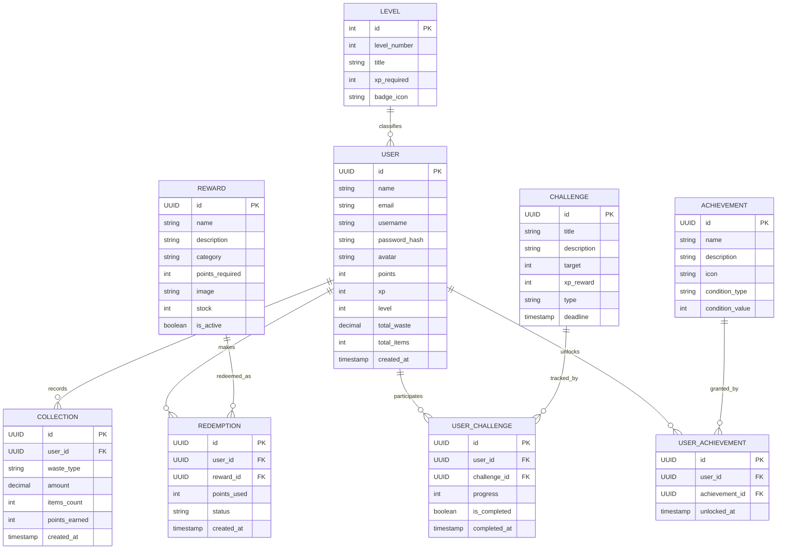

# ♻️ EcoPoint — Entity Relationship Diagram (Backend)

> Skema database & arsitektur backend **Golang (REST API)** untuk platform gamifikasi pengumpulan sampah EcoPoint. Melengkapi `prd.md` (frontend React + Vite).

---

## 1. Backend Tech Stack

```text
Golang
  ↓
HTTP API / REST API
  ↓
Business Logic
  ↓
Database
```

### 1.1 Backend Responsibilities
- Register, Login, Logout pengguna (authentication & JWT/session).
- Validasi data pengguna.
- Mengelola points, XP, level, dan environmental impact.
- Mencatat collection sampah (jenis, berat, jumlah item).
- Mengelola rewards dan proses redemption.
- Mengelola challenges (daily/weekly) dan achievement/badge.
- Menghitung serta menyediakan data leaderboard.
- Menyediakan REST API yang dikonsumsi frontend React.

### 1.2 Project Structure
```text
backend/
├── cmd/
├── config/
├── handlers/          # HTTP handler per resource (user, collection, reward, dst)
├── middleware/        # auth middleware, logging, CORS
├── models/            # struct entitas (User, Collection, Reward, dst)
├── routes/
├── services/          # business logic (points calc, level up, redeem)
├── repositories/       # akses database per entitas
├── database/
├── go.mod
└── main.go
```

### 1.3 Frontend ↔ Backend ↔ Database
```text
┌─────────────────────────────────────────────────────────┐
│ FRONTEND — React + Vite                                 │
│ Landing Page • Auth • Dashboard • Rewards • Profile    │
└─────────────────────────────────────────────────────────┘
                         │
                  HTTP / REST API
                         │
                         ▼
┌─────────────────────────────────────────────────────────┐
│ BACKEND — Golang                                         │
│ Authentication • Business Logic • Points • XP          │
│ Collection • Rewards • Challenges • Leaderboard        │
└─────────────────────────────────────────────────────────┘
                         │
                         ▼
┌─────────────────────────────────────────────────────────┐
│ DATABASE                                                 │
│ User • Collection • Reward • Redemption • Challenge   │
│ UserChallenge • Achievement • UserAchievement          │
└─────────────────────────────────────────────────────────┘
```

---

## 2. Entity List

### 2.1 User
| Field | Type | Constraint |
|---|---|---|
| id | UUID / BIGINT | PK |
| name | VARCHAR(100) | NOT NULL |
| email | VARCHAR(150) | UNIQUE, NOT NULL |
| username | VARCHAR(50) | UNIQUE, NOT NULL |
| password_hash | VARCHAR(255) | NOT NULL |
| avatar | VARCHAR(255) | NULLABLE |
| points | INT | DEFAULT 0 |
| xp | INT | DEFAULT 0 |
| level | INT | DEFAULT 1 |
| total_waste | DECIMAL(10,2) | DEFAULT 0 — dalam KG |
| total_items | INT | DEFAULT 0 |
| created_at | TIMESTAMP | NOT NULL |
| updated_at | TIMESTAMP | NOT NULL |

### 2.2 Collection
Catatan setiap kali user menyetor sampah.

| Field | Type | Constraint |
|---|---|---|
| id | UUID / BIGINT | PK |
| user_id | UUID / BIGINT | FK → User.id |
| waste_type | VARCHAR(50) | NOT NULL — plastic_bottle, plastic_bag, dll |
| amount | DECIMAL(10,2) | NOT NULL — dalam KG |
| items_count | INT | DEFAULT 0 |
| points_earned | INT | NOT NULL |
| created_at | TIMESTAMP | NOT NULL |

### 2.3 Level
Master data level/tier gamifikasi.

| Field | Type | Constraint |
|---|---|---|
| id | INT | PK |
| level_number | INT | UNIQUE, NOT NULL |
| title | VARCHAR(50) | NOT NULL — "Eco Starter", "Earth Guardian", dst |
| xp_required | INT | NOT NULL |
| badge_icon | VARCHAR(255) | NULLABLE |

### 2.4 Challenge
Master data tantangan harian/mingguan.

| Field | Type | Constraint |
|---|---|---|
| id | UUID / BIGINT | PK |
| title | VARCHAR(150) | NOT NULL |
| description | TEXT | NULLABLE |
| target | INT | NOT NULL — misal: 10 item |
| xp_reward | INT | NOT NULL |
| type | VARCHAR(20) | daily / weekly |
| deadline | TIMESTAMP | NOT NULL |
| created_at | TIMESTAMP | NOT NULL |

### 2.5 UserChallenge
Junction table — progress tiap user terhadap tiap challenge.

| Field | Type | Constraint |
|---|---|---|
| id | UUID / BIGINT | PK |
| user_id | UUID / BIGINT | FK → User.id |
| challenge_id | UUID / BIGINT | FK → Challenge.id |
| progress | INT | DEFAULT 0 |
| is_completed | BOOLEAN | DEFAULT false |
| completed_at | TIMESTAMP | NULLABLE |

### 2.6 Achievement
Master data badge yang bisa di-unlock.

| Field | Type | Constraint |
|---|---|---|
| id | UUID / BIGINT | PK |
| name | VARCHAR(100) | NOT NULL — "First Collection", dst |
| description | TEXT | NULLABLE |
| icon | VARCHAR(255) | NULLABLE |
| condition_type | VARCHAR(50) | NOT NULL — total_items, total_waste, streak |
| condition_value | INT | NOT NULL |

### 2.7 UserAchievement
Junction table — badge yang sudah diperoleh user.

| Field | Type | Constraint |
|---|---|---|
| id | UUID / BIGINT | PK |
| user_id | UUID / BIGINT | FK → User.id |
| achievement_id | UUID / BIGINT | FK → Achievement.id |
| unlocked_at | TIMESTAMP | NOT NULL |

### 2.8 Reward
Master data reward yang bisa ditukar dengan poin.

| Field | Type | Constraint |
|---|---|---|
| id | UUID / BIGINT | PK |
| name | VARCHAR(150) | NOT NULL |
| description | TEXT | NULLABLE |
| category | VARCHAR(50) | NULLABLE — voucher / cash / merchandise / donation |
| points_required | INT | NOT NULL |
| image | VARCHAR(255) | NULLABLE |
| stock | INT | DEFAULT 0 |
| is_active | BOOLEAN | DEFAULT true |

### 2.9 Redemption
Riwayat penukaran poin dengan reward.

| Field | Type | Constraint |
|---|---|---|
| id | UUID / BIGINT | PK |
| user_id | UUID / BIGINT | FK → User.id |
| reward_id | UUID / BIGINT | FK → Reward.id |
| points_used | INT | NOT NULL |
| status | VARCHAR(20) | pending / completed / cancelled |
| created_at | TIMESTAMP | NOT NULL |

---

## 3. Relationships

```text
User        (1) ──── (N) Collection
User        (1) ──── (N) Redemption
User        (1) ──── (N) UserChallenge   ──── (N:1) Challenge
User        (1) ──── (N) UserAchievement ──── (N:1) Achievement
Reward      (1) ──── (N) Redemption
Level       (1) ──── (N) User            (referensi level saat ini, opsional FK)
```

- **User → Collection**: satu user bisa punya banyak riwayat setoran sampah. Setiap `Collection` menambah `points`, `xp`, `total_waste`, `total_items` milik user lewat service layer.
- **User ↔ Challenge**: many-to-many lewat `UserChallenge` — satu challenge diikuti banyak user, satu user bisa ikut banyak challenge dengan progress berbeda.
- **User ↔ Achievement**: many-to-many lewat `UserAchievement` — mencatat kapan badge tertentu ter-unlock untuk user tertentu.
- **User → Redemption → Reward**: `Redemption` adalah tabel transaksi penghubung `User` dan `Reward`; `points_used` mengurangi `points` user saat status `completed`.
- **Level**: master table opsional agar `xp_required` per level mudah diubah tanpa redeploy.

---

## 4. ER Diagram (Mermaid)



---

## 5. ASCII Overview (ringkas)

```text
┌──────────┐        ┌────────────┐
│  LEVEL   │ 1 ── N │    USER    │
└──────────┘        └─────┬──────┘
                           │
        ┌──────────────────┼──────────────────┬────────────────────┐
        │                  │                  │                    │
        ▼                  ▼                  ▼                    ▼
 ┌─────────────┐  ┌────────────────┐ ┌──────────────────┐ ┌──────────────┐
 │ COLLECTION  │  │  REDEMPTION    │ │  USER_CHALLENGE  │ │USER_ACHIEVEM.│
 └─────────────┘  └───────┬────────┘ └────────┬─────────┘ └──────┬───────┘
                          │                    │                  │
                          ▼                    ▼                  ▼
                    ┌──────────┐        ┌──────────┐       ┌─────────────┐
                    │  REWARD  │        │CHALLENGE │       │ ACHIEVEMENT │
                    └──────────┘        └──────────┘       └─────────────┘
```

---

## 6. Golang Model Sketch

```go
// models/user.go
type User struct {
    ID          string    `json:"id" db:"id"`
    Name        string    `json:"name" db:"name"`
    Email       string    `json:"email" db:"email"`
    Username    string    `json:"username" db:"username"`
    PasswordHash string   `json:"-" db:"password_hash"`
    Avatar      string    `json:"avatar" db:"avatar"`
    Points      int       `json:"points" db:"points"`
    XP          int       `json:"xp" db:"xp"`
    Level       int       `json:"level" db:"level"`
    TotalWaste  float64   `json:"total_waste" db:"total_waste"`
    TotalItems  int       `json:"total_items" db:"total_items"`
    CreatedAt   time.Time `json:"created_at" db:"created_at"`
}

// models/collection.go
type Collection struct {
    ID            string    `json:"id" db:"id"`
    UserID        string    `json:"user_id" db:"user_id"`
    WasteType     string    `json:"waste_type" db:"waste_type"`
    Amount        float64   `json:"amount" db:"amount"`
    ItemsCount    int       `json:"items_count" db:"items_count"`
    PointsEarned  int       `json:"points_earned" db:"points_earned"`
    CreatedAt     time.Time `json:"created_at" db:"created_at"`
}
```
> Struct lain (`Reward`, `Redemption`, `Challenge`, `UserChallenge`, `Achievement`, `UserAchievement`) mengikuti pola field yang sama seperti tabel di Section 2.

---

## 7. REST API Endpoint (Ringkasan)

```text
Auth
POST   /api/auth/register
POST   /api/auth/login
POST   /api/auth/logout

User
GET    /api/users/me
PUT    /api/users/me

Collection
POST   /api/collections
GET    /api/collections            (riwayat user)

Challenge
GET    /api/challenges
GET    /api/challenges/me          (progress user)
POST   /api/challenges/:id/progress

Achievement
GET    /api/achievements
GET    /api/achievements/me

Reward
GET    /api/rewards
POST   /api/rewards/:id/redeem

Leaderboard
GET    /api/leaderboard?range=week|month|all
```

---

## 8. Notes

- `points`, `xp`, `total_waste`, `total_items` pada `User` bersifat **denormalized/cached** dari agregat `Collection` dan `Redemption` — dipertahankan agar query dashboard cepat, diperbarui lewat service layer setiap ada `Collection`/`Redemption` baru.
- `UserChallenge` dan `UserAchievement` sengaja dipisah sebagai junction table agar riwayat progres/unlock per user tetap tersimpan meski `Challenge`/`Achievement` induknya berubah/diarsipkan.
- Untuk MVP, `Level` boleh disederhanakan jadi enum/konstanta di kode Go, alih-alih tabel terpisah — berguna kalau level ingin dikelola dinamis dari admin panel di kemudian hari.
- Detail tampilan/UI dan komponen frontend yang mengonsumsi endpoint di atas ada di `prd.md`.
